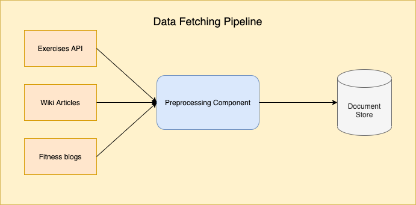
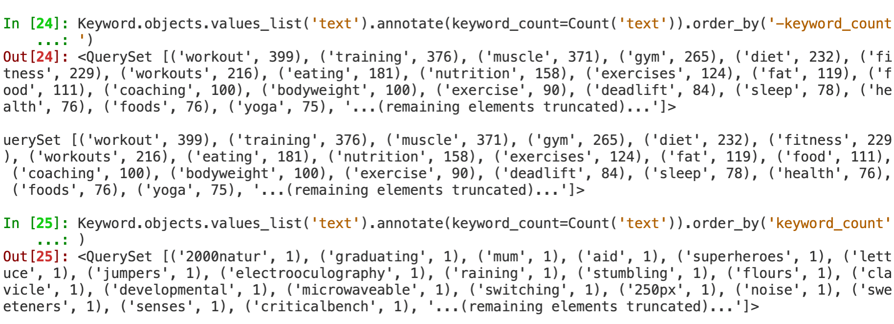

# Fitness QA System

## Problem

As with most of the question answering implementations out there, we aimed to construct a system that gives answers for our specific domain by querying a structured database of knowledge, usually called a knowledge base.

As opposed to open-domain question answering that deals with questions about pretty much anything, closed-domain question answering deals with questions under a specific domain which is the problem we attempt at solving, for fitness domain.

Our greatest stumbling block for this specific problem was data - or a lack of it to be precise. Since there was no dataset out there that contains text data in fitness and nutrition domain based on facts, we needed to be creative in generating documents that contain facts about fitness.

We needed fitness specific data for finetuning the models that are pretrained on [SQuAD](https://rajpurkar.github.io/SQuAD-explorer/) dataset, but also for knowledge base that will be queried to search for the answer in inference step.

## Data sources

To get the data we need for fine-tuning (transfer learning) we exploited 3 data sources in order to be able to cover most of the questions and terms for this domain.

Data fetching pipeline can be seen on the following image:



### Exercises API

We have used [this](https://github.com/davejt/exercise) API described as open API of common bodybuilding and weightlifting exercises. It can be queried based on muscle group to provide names of good exercises to work that specific group. We then created over 30 sentence templates that describe how these exercises should be added to the workout. Result file can be seen [here](./web-app/data/workout_sentences.txt). The idea behind this is to be able to answer questions that should provide tips on what exercise is good for a specific muscle group, as these questions are the most common use-case for this question bot.

### Wiki Articles

We have scraped Wikipedia articles for categories like `Aerobics`, `Bodyweight exercises`, `Running`, `Yoga`, `Weight training`, `Nutrition`, ... that gave us over 100 articles related to our specific domain that contain factual information about it.

### Fitness Blogs

We have scraped articles from various fitness blogs like `Muscle and Fitness`, `My fitness pal`, `Love sweat fitness`, `Breaking muscle fitness` `Advanced human performance`, ... to get useful tips on the fitness domain. More details on which blogs were used or how scraping worked can be seen in [this file](./web-app/src/qa/management/commands/preprocess_articles.py)

### Preprocessing

Since various data sources were used, preprocessing step was required to put all that data in correct format for further processing. This step included parsing and removing different HTML tags, header and footer tags and hyperlinks from Wikipedia articles, lemmatization etc. We have tried removing stop words from our data but turns out it made our predictions slightly worse, based on evaluation metric that was used. 

Since our data came from sources like blogs, there were numerous sentences containing information about contests, specific brands that are for sale or fitness instructors that we didn't need in our data. To filter out that data, we did part-of-speech (POS) tagging and named entity recognition to try and drop sentences that contained this type of information.

Also, we have used BERT model to generate keywords and keyphrases from documents that we scrape. We have later used these keywords to manually filter out some documents.

Results can be seen on image below:


## Unsupervised approach

We have used approach described in the ACL 2019 Paper: [Unsupervised Question Answering by Cloze Translation](https://arxiv.org/abs/1906.04980).

This approach basically performs following steps on passed text:
1. Generate answer candidates within passed context (using NER checkers).
2. Given context and answer candidates, "fill the blank" cloze questions are generated.
3. Cloze questions are converted to natural questions using cloze-to-natural question translator

Here is an image, taken from the paper mentioned above, that explains this pipeline:


We have added a 4. step to this pipeline that uses T5 Text-to-Text Transfer Transformer model for paraphrasing output questions to get more variety and increase the dataset. More details are given in the next chapter on data augmentation.

## Data Augmentation

In order to get more data to improve performance and accuracy, we tried different NLP augmentation approaches.

There are various character and word augmenters that try to swap, mask or add random characters or words into the sentence to make the model work on questions that contain spelling errors for instance. This usecase wasn't important for our specific implementation so we didn't use these augmenters in our system.

We have tried augmentors on the following input questions to see if we can benefit from them:
```
"What is the best fitness exercise for biceps?",
"How to build strong core?",
"What is stamina?",
"What is whey protein?",
"How to get more muscle mass?",
"What is muscle hypertrophy?",
"How to get quickly shredded for summer?"
```

### WordNet synonym augmenter

WordNet synonym augmenter is supposed to swap certain words with their synonyms using wordnet database. Following results were generated using this approach:

```
"What is the best fittingness exercise for biceps?",
"How to build firm core?",
"What be stamina?",
"What is whey protein?",
"How to get more than muscularity mass?",
"What is muscle hypertrophy?",
"How to get chop chop tear up for summer?"
```

### BERT base augmenter

BERT base augmenter is supposed to insert words by contextual word embeddings (words that are similar in that vector space). Following results were generated using this approach:

```
"what is the best fitness over exercise, for biceps?",
"how to build strong ice core?",
") what is stamina?",
"what sugar is whey protein?",
"how next to get more muscle throughout mass?",
". what syndrome is muscle hypertrophy?",
"how to get quickly food shredded there for summer?"
```

### T5 Text-to-Text Transfer Transformer

The input to this transformer is any general quesiton you can think of. Output should be paraphrased question that was given as an input. The model was trained on [Quora Question Pairs](https://quoradata.quora.com/First-Quora-Dataset-Release-Question-Pairs) dataset. To see more details about this model, visit [this link](https://github.com/ramsrigouthamg/Paraphrase-any-question-with-T5-Text-To-Text-Transfer-Transformer-). Following results were generated using this approach:

For input question:

```
"What is the best fitness exercise for biceps?"
```

Results were:

```
0: What is the best exercise for biceps?
1: What are some of the best exercise for biceps?
2: What are some fitness exercises for biceps?
3: What should be the most effective workout regime for the bicep?
4: What's the best fitness exercise to do for your biceps?
5: What are the best exercise habits for biceps?
6: What is the best exercise to improve your biceps?
7: What are the best exercises to increase the biceps?
```

For input question:

```
"How to build strong core?"
```

Results were:

```
0: How does a person build a strong core?
1: How do i build a strong core?
2: How can a guy build a strong core?
3: What are the strategies to build a strong core?
4: How can I build a strong core?
5: How can I build strong core?
6: How do I build strong core?
7: How do you build a strong core?
```

For input question:

```
"What is stamina?"
```

Results were:
```
0: What does stamina do?
1: How can you make yourself stamina resistant?
2: What are stamina?
```

For input question:

```
"What is whey protein?"
```

Results were:
```
0: What are whey protein and why is it important?
1: What is whey protein? What are some examples?
2: What does whey protein do? What is the meaning?
```

For input question:

```
"How to get more muscle mass?"
```

Results were:

```
0: How can I get active and mass?
1: What are the best ways to build muscle mass?
2: How do I build muscle mass fast?
3: How do I gain muscle mass?
4: How do I increase muscle mass?
5: How can I gain more muscle mass?
6: How can you get more muscle mass?
7: How do I gain muscle mass naturally?
```

For input question:

```
"What is muscle hypertrophy?"
```

Results were:

```
0: What is muscle hypertrophy and why is it called important?
1: What is muscle hypertrophy? How does it work?
2: What is muscular hypertrophy?
```

For input question:

```
"How to get quickly shredded for summer?"
```

Results were:

```
0: How should I shredded for summer?
1: How do I get shredded for summer?
2: What are some ways to get shredded for summer?
3: How can I get shredded quickly?
4: What are some tips for getting quick shredded for summer?
5: How do you get quickly shredded as a summer warrior?
6: How do I get quick shredded for summer?
7: What are the best ways to get shredded in the summer?
8: How can you get shredded for summer?
```

We have decided to include this augmenter in our pipeline but the evaluation metric was slightly worse so we dropped this step entirely.

## Dataset

Fitness dataset generated synthetically had 4000 text documents (and 5356 questions) in the training and 1000 text documents (and 1124 questions) in the test dataset.

We have also used [this](https://s3.eu-central-1.amazonaws.com/deepset.ai-farm-qa/datasets/nq_dev_subset_v2.json.zip) dataset that is a subset of Natural Questions dataset to test how finetune models perform on open domain questions (so we can see if they can still generalize well after finetuning).

## Approaches & Architecture

For solving the actual question answering problem, we have used reader-retriever architecture. Basically retriever component is supposed to get document candidates from the document store that might contain an answer to the input question, whereas reader is a language model that makes the actual prediction given the context and a question. More about this architecture can be read [here](https://arxiv.org/pdf/1905.05733.pdf).

Overview of reader-retriever architecture is given on the image below:


### Simple baseline approach

For the baseline approach, we have used TF-IDF embedding and cosine similarity to get candidate sentences based on question. After that, we use NER and POS tagging to extract what type of question is being asked and try to find answer based on that. To see details of this implementation refer to [this file](./web-app/src/qa/management/commands/evaluate_baseline.py)

This implementation has certain limitations, so for reader component we used an actual language model described below.

### Reader LM

For the reader, we attempt at using [ROBERTA](https://arxiv.org/pdf/1907.11692.pdf) and [MiniLM](https://arxiv.org/abs/2002.10957) and compare results that they give.

`ROBERTA` was introduced at Facebook, it is basically a retrained BERT with improved training methodology. It removes Next Sentence Prediction step and introduces dynamic masking that changes during training. More about this can be found [here](https://arxiv.org/pdf/1907.11692.pdf).

`MiniLM` uses deep self-attention distillation to compress large Transformer model by using a small model (student) that is trained to mimick the self-attention module used in Transformer network (teacher). More about this can be found [here](https://arxiv.org/abs/2002.10957).


### Retriever

Retrievers can be categorized in two groups:
1. `sparse` - keyword based (e.g. BM25, TF-IDF)
2. `dense` - neural network based (e.g. DRP)

Dense methods are more accurate as they translate questions and documents to same embedding space where they can be compared semantically, compared to sparse methods that are usually based on mathematical formulas that compute relevance based on frequency.

This is the main reason we have chosen to use Dense Passage Retrieval for our implementation. It uses BERT network to make embeddings of documents and questions. We saved embedded documents in ElasticSearch for fast querying using cosine similarity. More about DRP can be found [here](https://arxiv.org/pdf/2004.04906.pdf).

### Model finetune

We have also applied transfer learning on `ROBERTA` and `MiniLM` models to see if it improves overall accuracy of the models. Dataset that is used for finetuning was already described in detail in previous chapters. Evaluation and analysis is given in the next chapter.

## Evaluation

As mentioned previously, synthetic dataset test data was used to evaluate the model, using F1 metric. We have also used [this](https://s3.eu-central-1.amazonaws.com/deepset.ai-farm-qa/datasets/nq_dev_subset_v2.json.zip) baseline dataset that is a subset of Natural Questions dataset to test how finetune models perform on open domain questions. Results of evaluation are given in the table below:

|                          | Baseline QA dataset F1 | Synthetic Fitness dataset F1 |
|--------------------------|------------------------|------------------------------|
| Simple baseline approach | 0.05                   | 0.15                         |
| MiniLM pretrained        | 0.19                   | 0.39                         |
| RoBERTa pretrained       | 0.30                   | 0.42                         |
| MiniLM finetuned         | 0.28                   | 0.70                         |
| RoBERTa finetuned        | 0.40                   | 0.75                         |

We can conclude that models trained on the synthetic data had improved accuracy on fitness based questions and also on open domain questions from baseline dataset.
